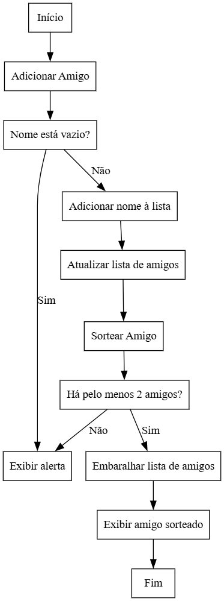

# Desafio Amigo Secreto - Sorteio Online

Este projeto foi criado para facilitar a realização de sorteios de "Amigo Secreto" online. A ideia é permitir que os usuários insiram os nomes de seus amigos, sorteiem aleatoriamente os amigos secretos e visualizem os resultados em tempo real, sem precisar de papel e caneta. O sistema é simples, intuitivo e utiliza HTML, CSS e JavaScript para criar uma experiência divertida e prática.

## Funcionalidades

- **Adicionar amigo(s)**: O usuário pode inserir os nomes dos amigos em um campo de entrada, e esses nomes serão armazenados em uma lista exibida na tela.
- **Exibir lista de amigo(s)**: A lista de amigos inseridos será mostrada em tempo real, facilitando o acompanhamento e a interação.
- **Sorteio do amigo secreto**: Ao clicar no botão "Sortear amigo", o sistema realiza o sorteio aleatório e exibe o resultado na tela.

## Tecnologias Utilizadas

- **HTML**: Estrutura da página e elementos do formulário.
- **CSS**: Estilo e layout da página, tornando a interface mais amigável.
- **JavaScript**: Lógica para captura de entradas do usuário, validação de dados e realização do sorteio dos amigos secretos.

## Como Usar

1. **Clonar o repositório**:
   Para começar a usar este projeto, clone o repositório para sua máquina local utilizando o comando:

   ```bash
   git clone https://github.com/seu-usuario/amigo-secreto.git
   ```

2. **Abrir o projeto**:
   - Abra o projeto no seu editor de código favorito.
   - Abra o arquivo `index.html` no seu navegador para visualizar o projeto em funcionamento.

## Funcionalidades Futuras

- **Persistência de dados**: Adicionar um mecanismo para salvar os dados dos amigos (ex: usando `localStorage` ou um banco de dados), permitindo que as informações não se percam quando a página for recarregada.
- **Personalização de sorteio**: Permitir que os usuários personalizem mensagens de sorteio (ex: incluir uma mensagem de boas festas ou algo mais pessoal).
- **Melhorias na validação de entrada**: Aperfeiçoar a validação para garantir que os nomes dos amigos não sejam duplicados ou estejam vazios.

## Como Contribuir

Se você deseja contribuir com este projeto, siga os passos abaixo:

1. Faça um fork do repositório.
2. Crie uma branch para sua funcionalidade (ex: `git checkout -b feature/novas-funcionalidades`).
3. Faça commit das suas alterações (`git commit -m 'Adicionando novas funcionalidades'`).
4. Envie para a branch principal (`git push origin feature/novas-funcionalidades`).
5. Abra um Pull Request explicando as mudanças feitas.

## Licença

Este projeto está licenciado sob a licença MIT. Consulte o arquivo `LICENSE` para mais detalhes. Ao utilizar ou modificar o código, por favor, faça referência a esta licença.

## Lógicas de Sorteio

O projeto oferece três lógicas diferentes de sorteio, cada uma com uma abordagem distinta. Abaixo estão as explicações e o código de cada variante.

### 1. Lógica para Sorteio Individual

Este sorteio é realizado para um único usuário. Após inserir os nomes dos amigos, o sistema sorteia um único amigo secreto para o usuário.

#### Código:

```javascript
let amigos = [];

// Função para adicionar um amigo à lista
function adicionarAmigo() {
    const inputNome = document.getElementById('amigo').value;

    if (inputNome === "") {
        alert("Por favor, insira um nome.");
        return;
    }

    amigos.push(inputNome);
    document.getElementById('amigo').value = "";
    atualizarListaAmigos();
}

// Função para atualizar a lista de amigos
function atualizarListaAmigos() {
    const listaAmigos = document.getElementById('listaAmigos');
    listaAmigos.innerHTML = "";

    for (let amigo of amigos) {
        const novoAmigo = document.createElement('li');
        novoAmigo.textContent = amigo;
        listaAmigos.appendChild(novoAmigo);
    }
}

// Função para sortear o amigo secreto
function sortearAmigo() {
    if (amigos.length < 2) {
        alert("Por favor, adicione pelo menos 2 amigos para sortear.");
        return;
    }

    // Embaralhar a lista de amigos
    let amigosEmbaralhados = amigos.slice();
    for (let i = amigosEmbaralhados.length - 1; i > 0; i--) {
        const j = Math.floor(Math.random() * (i + 1));
        [amigosEmbaralhados[i], amigosEmbaralhados[j]] = [amigosEmbaralhados[j], amigosEmbaralhados[i]];
    }

    // Exibir o amigo sorteado
    const amigoSorteado = amigosEmbaralhados[0];
    const resultado = document.getElementById('resultado');
    resultado.innerHTML = `Amigo sorteado: ${amigoSorteado}`;
}
```

### 2. Lógica para Sorteio de Grupo

Esta lógica sorteia todos os amigos ao mesmo tempo, exibindo os resultados de forma coletiva.

#### Código:

```javascript
// Função para sortear todos os amigos ao mesmo tempo
function sortearAmigos() {
    if (amigos.length < 2) {
        alert("Por favor, adicione pelo menos 2 amigos para sortear.");
        return;
    }

    // Embaralhar a lista de amigos
    let amigosEmbaralhados = amigos.slice();
    for (let i = amigosEmbaralhados.length - 1; i > 0; i--) {
        const j = Math.floor(Math.random() * (i + 1));
        [amigosEmbaralhados[i], amigosEmbaralhados[j]] = [amigosEmbaralhados[j], amigosEmbaralhados[i]];
    }

    // Exibir os resultados
    const resultado = document.getElementById('resultado');
    resultado.innerHTML = "";

    amigosEmbaralhados.forEach(function(amigo, index) {
        const li = document.createElement('li');
        li.textContent = `${amigo} foi sorteado para o amigo secreto!`;
        resultado.appendChild(li);
    });
}
```

### 3. Lógica para Sorteio com Modal

Aqui, o usuário tem a opção de escolher entre o sorteio individual ou para o grupo através de um modal.

#### Código:

```javascript
let amigos = [];

// Função para adicionar um amigo à lista
function adicionarAmigo() {
    const inputNome = document.getElementById('amigo').value;

    if (inputNome === "") {
        alert("Por favor, insira um nome.");
        return;
    }

    amigos.push(inputNome);
    document.getElementById('amigo').value = "";
    atualizarListaAmigos();
}

// Função para atualizar a lista de amigos
function atualizarListaAmigos() {
    const listaAmigos = document.getElementById('listaAmigos');
    listaAmigos.innerHTML = "";

    for (let amigo of amigos) {
        const novoAmigo = document.createElement('li');
        novoAmigo.textContent = amigo;
        listaAmigos.appendChild(novoAmigo);
    }
}

// Função para exibir o modal
function mostrarModal() {
    document.getElementById('modal').style.display = "block";
}

// Função para fechar o modal
function fecharModal() {
    document.getElementById('modal').style.display = "none";
}

// Função para sortear individualmente
function sortearIndividual() {
    if (amigos.length < 2) {
        alert("Por favor, adicione pelo menos 2 amigos para sortear.");
        return;
    }

    let amigosEmbaralhados = amigos.slice();
    for (let i = amigosEmbaralhados.length - 1; i > 0; i--) {
        const j = Math.floor(Math.random() * (i + 1));
        [amigosEmbaralhados[i], amigosEmbaralhados[j]] = [amigosEmbaralhados[j], amigosEmbaralhados[i]];
    }

    const amigoSorteado = amigosEmbaralhados[0];
    const resultado = document.getElementById('resultado');
    resultado.innerHTML = `Amigo sorteado: ${amigoSorteado}`;
    fecharModal();
}

// Função para sortear todos os amigos ao mesmo tempo
function sortearGrupo() {
    if (amigos.length < 2) {
        alert("Por favor, adicione pelo menos 2 amigos para sortear.");
        return;
    }

    let amigosEmbaralhados = amigos.slice();
    for (let i = amigosEmbaralhados.length - 1; i > 0; i--) {
        const j = Math.floor(Math.random() * (i + 1));
        [amigosEmbaralhados[i], amigosEmbaralhados[j]] = [amigosEmbaralhados[j], amigosEmbaralhados[i]];
    }

    const resultado = document.getElementById('resultado');
    resultado.innerHTML = "";

    amigosEmbaralhados.forEach(function(amigo, index) {
        const li = document.createElement('li');
        li.textContent = `${amigo} foi sorteado para o amigo secreto!`;
        resultado.appendChild(li);
    });

    fecharModal();
}
```

---

## Estrutura do Projeto

```bash
/desafio-amigo-secreto
│
├── /1-sorteio-grupo
│   ├── index.html
│   ├── app.js
│   └── style.css
│   └── README.md
│
├── /2-sorteio-individual
│   ├── index.html
│   ├── app.js
│   └── style.css
│   └── README.md
│
└── /3-especial-modal
    ├── index.html
    ├── app.js
    └── style.css
    └── README.md
```
### Diagramas

Fluxograma - fluxograma_sorteio_grupo
Fluxograma - fluxograma_sorteio_modal
Diagrama UML - diagrama em UML sorteio INDIVIDUAL
Diagrama UML - diagrama em UML sorteio GRUPO
Diagrama UML - diagrama em UML sorteio MODAL


```markdown



